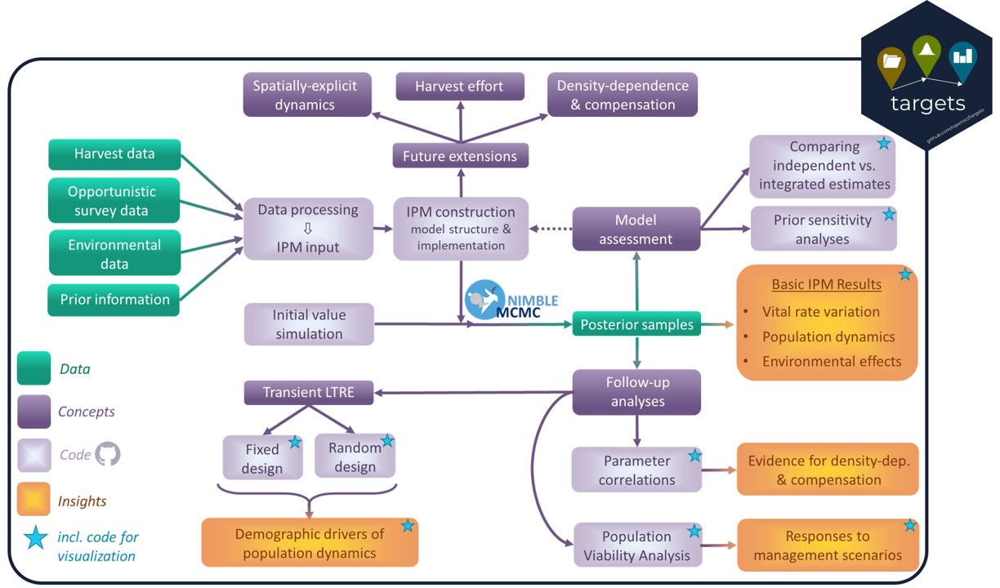

# VredfoxIPM: an integrated population modelling workflow for supporting mesopredator management    

This repository contains code for a reproducible, modular workflow for Bayesian integrated population analysis (using Nimble, <https://github.com/nimble-dev/nimble>) for hunted red foxes on the Varanger penninsula, Norway. 

The workflow is available as both a manual implementation ("RedFox_IPM_Analysis.R") and as a semi-automated  "targets" pipeline (see <https://books.ropensci.org/targets/>) and contains the following parts: 
- Download of raw data from COAT data portal (<https://data.coat.no/>)
- Wrangling, formatting, and preparation of observational data and prior information
- Definition and setup of integrated population model (IPM)
- Complete simulation of initial values
- Running of IPM using MCMC
- Extraction and visualization of primary results
- Follow-up analyses (incl. vizualizations)

A schematic overview of the workflow and its parts is shown below: 

The workflow is fully function-based, and each function is documented in its respective script within the folder "R".
The folder "vignettes" contains a richly documented "walkthrough" of the manual workflow ("workflow_walkthrough.Rmd"), including instructions for installing necessary dependencies and accessing all requisite data. 

Auxiliary data, computed results, and finished plots and other visualizations can be found on OSF: 
<https://osf.io/756re/>

The scientific article associated with this repository and presenting the workflow and results on Varanger red foxes will shortly be made available as a pre-print. 

