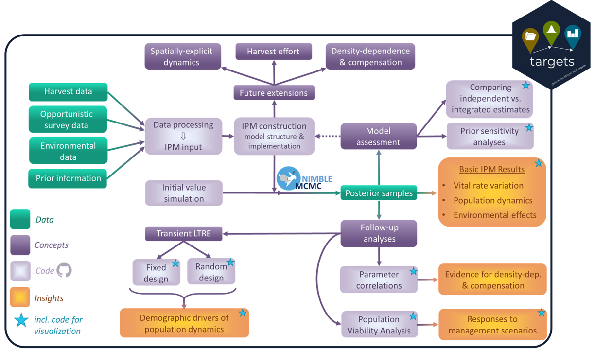

```{r setup, include=FALSE}
knitr::opts_chunk$set(echo = TRUE)
knitr::opts_knit$set(root.dir = "..")
```

## About this document
In this document, we walk you through the application of an integrated popupulation modelling workflow to data collected from en expanding population of red foxes on Varanger penninsula (Arctic Norway). The workflow (see schematic below) uses data collected from harvested foxes together with information from opportunistic den surveys and red fox literature to fit an integrated population model (IPM), and subsequently investigates the drivers of population dynamics using both retrospective (transient Life Table Response Experiments, tLTREs) and prospective (Population Viability Analyses, PVAs) perturbation analyses and is presented in:

Nater, C. R, Hofhuis, S. P., Grainger, M., Flagstad, Ø., Ims, R. A., Killengreen S., Ehrich D. (2024).
An integrated population modelling workflow for supporting mesopredator management. *EcoEvoRxiv*. 
DOI:*[TBA]*

This document is a fully annotated version of the manual workflow presented in "RedFox_IPM_Analysis.R". 

For running the semi-automated version of the workflow implemented with "targets" (see "_targets.R"), you will also have to complete the tasks outlined in the section "Before you start" below first. Following that, you should be able to run everything via `targets::tar_make()`. For more information on using "targets", see: <https://books.ropensci.org/targets/>




## Before you start
The code in the following uses relative directory and file paths. For that to work smoothly, we need to make sure that the walkthrough (.Rmd file) uses the same root directory as the project repository. Since the walkthrough is located inside a subfolder "vignettes", we have to move the working directory up one level. For knitting this document, that is taken care of by `knitr::opts_knit$set(root.dir = "..")` in the setup chunk. If we want to work through the document interactively, though, we need to double-check that the working directory is set to the root directory (using `getwd()`). This should be the case if you have opened the Rproject ("VredfoxIPM.Rproj"), but if we are instead inside the "vignettes" folder, we have to move the working directory up one level: 

```{r, eval = FALSE}
setwd("..")
```

Before getting into running the code for the analyses, we have to make sure that we have all the necessary data in the right directories and that all the dependencies are installed. 

### Retrieving data
The data from harvested red foxes that forms the core of this analysis, as well as the covariate data on small rodent abundance, are stored in the COAT data portal (<https://data.coat.no/>). 
The relevant data tables are called "V_redfox_carcass_examination" (version 3: <https://data.coat.no/dataset/v_redfox_carcass_examination_v3>) and "V_rodents_snaptrapping_abundance_regional" (version 5, <https://data.coat.no/dataset/v_rodents_snaptrapping_abundance_regional_v5>). Both are datasets that are under embargo; access tokens can be requested through Dr. Dorothée Ehrich (dorothee.ehrich@uit.no). 
This workflow connects directly to the COAT data portal from R and requires that you save your access token as an environmental variable named "COAT_API".
*NOTE:* if you want to run the analyses without accessing the COAT data portal, you can download the formatted model input data from our OSF storage: file "Input_Data/IPM_InputData_processed/RedFox_IPM_InputData.rds" on <https://osf.io/756re/>. The R-object contained in this file corresponds to the object `input.data` that appears downstream in the workshop. 

In addition to the fox harvest and rodent data sets, this workflow also requires four auxiliary data sources: data on genetic population assignment of foxes ("RedFox_genetics_immigrant_probabilities.txt"), data from opportunistic den surveys ("Rfox_early_litter_sizes.csv"), data on reindeer carcass availability ("KadaverOstFinnmark-22.rds" and "KadaverOstF-GamvikLebesby-22.rds"), and demographic information on red foxes from the literature ("RedFox_LiteratureData.csv" and "HoenigMod_Posteriors_fromTomPorteus.txt"). By default, the relevant data files should be contained within the "Data" folder in the repository. If any of them happen to be missing, they can also be downloaded from OSF: <https://osf.io/756re/>.

Finally, data preparation relies on spatial information that is contained a range of shapefiles. As these are not suitable for uploading to GitHub, you have to retrieve them from the folder "Input_Data/StudyArea_Shapefile" on OSF and place them in a folder named "shapefiles" within the "Data" folder in the repository. 


### Installing dependencies
Next, we want to make sure you have all the dependencies installed. 

This includes all R packages needed for retrieving and wrangling data, running analyses, and visualizing results, etc. For each one, the code below checks if it is available, and installs it if not.

```{r, message = FALSE, warning = FALSE}
pkg.list <- c("ckanr", "coda", "dplyr", "MCMCvis", "metafor", "patchwork", "purr", "remotes", "reshape2", "sf", "truncnorm")
for(i in 1:length(pkg.list)){
  if(!(pkg.list[i] %in% installed.packages())){
    install.packages(pkg.list[i], repos = "http://cran.us.r-project.org")
  }
}
```

Finally, we also need to install the `nimble` R package. This package is required to use the NIMBLE compiler (see <https://r-nimble.org/> for more information) for model fitting. Installing and using NIMBLE requires us to have a compiler and a set of related tools readily available. Instructions on how to make sure we have these available can be found on the NIMBLE website under "Download": <https://r-nimble.org/downloadhttps://r-nimble.org/download>
Once we know that we have a compiler and that it works, we can install the `nimble`package just like the other R packages:

```{r, message = FALSE, warning = FALSE}
if(!("nimble" %in% installed.packages())){
  install.packages("nimble", repos = "http://cran.us.r-project.org")
}
```

## Workflow setup

We start by loading all the necessary packages, setting the seed to ensure reproducibility, and sourcing all the custom functions that are stored in the "R" folder. 
```{r, eval = FALSE}
library(ggplot2)
library(nimble)
library(sf)
library(reshape2)
library(remotes)
library(ckanr)
library(purrr)
library(dplyr)
library(metafor)
library(patchwork)
library(coda)

## Set seed
mySeed <- 10

## Source all functions in "R" folder
sourceDir <- function(path, trace = TRUE, ...) {
  for (nm in list.files(path, pattern = "[.][RrSsQq]$")) {
    if(trace) cat(nm,":")
    source(file.path(path, nm), ...)
    if(trace) cat("\n")
  }
}
sourceDir('R')
```
Each functions is assigned a task in the workflow, and is contained in its own script including roxygen documentation that details purpose, input, and output formats.

The functions involved in data processing require us to make a range of decisions about how the data should be subsetted and aggregated, such as the numbers of age classes (`Amax`) and years (`Tmax`) to consider in the analyses. These decisions are detailed in the next chunk:
```{r, eval = FALSE}
Amax <- 5 # Number of age classes
Tmax <- 18  # Number of years
minYear <- 2004 # First year to consider
maxAge_yrs <- 10 # Age of the oldest female recorded
summer_removal <- c(6,7,8,9) # Summer months (to be removed from "winter harvest")
winter_removal <- c(1:6, 10:12) # Winter months (to be removed from "summer harvest")
area_selection <- c("Inner", "BB", "Tana") # Locations that define the Aaranger sub area (BB = Batsfjord and Berlevag counties)

# Start and end dates of placental scars and embryo sampling periods (julian day)
plac_start <- 180 #including
plac_end   <- 80  #until, not including
embr_start <- 100 #including
embr_end   <- 140 #until, not including
```

Next, we have to set the names, versions, directories, and access tokens for the datasets to be retrieved from the COAT data portal (see section "Retrieving data" above for details). Note that the access token for the data portal is extracted from an environmental variable here, but you can also directly assign your token to ``COAT_key`` instead:
```{r, eval = FALSE}
## set dataset names, versions, and directories, and access
carcass.dataset.name <- "v_redfox_carcass_examination_v3"
carcass.dataset.version <- 3

rodent.dataset.name <-"v_rodents_snaptrapping_abundance_regional_v5"
rodent.dataset.version <- 5

shapefile.dir <- "Data/shapefiles"
COAT_key <- Sys.getenv("COAT_API")
```

The red fox workflow contains a modular analysis, meaning that there are a range of toggles ("switches") that can be use to customize model structure and assumptions. The first set of toggles deals with the use of environmental covariates and temporal random effects fit on different vital rates:
```{r, eval = FALSE}
# Covariate toggles
fitCov.mH <- FALSE # Fit covariates on mH (harvest effort)
fitCov.mO <- TRUE # Fit covariates on mO (rodent abundance x reindeer carcasses)
fitCov.Psi <- TRUE # Fit covariates on Psi (rodent abundance)
fitCov.rho <- TRUE # Fit covariates on rho (rodent abundance)
fitCov.immR <- TRUE # Fit covariates on immigration rate (rodent abundance) - only if immigration is estimated as a rate
rCov.idx <- FALSE # Use discrete vs. continuous rodent covariate
nLevels.rCov <- 2 # 2-level discrete rodent covariate (3-level discrete not currently supported)
standSpec.rCov <- TRUE # standardize different rodent species before summing (offset catchability) v.s. simply sum all numbers
reinCov.VarTana <- TRUE # Calculate the reindeer carcass data count covariate using Varanger (+Tana) municipalities as geographical area. FALSE is for whole of Eastern Finnmark.

# Random year effect toggles
mO.varT <- TRUE
```

The next set deal with the inclusion of summer harvest data, specifically whether age information should be used and for which years summer harvest should be included. In our main analysis, we do not use age information from summer harvest as we suspect these to be biased (not representative of the population) and we only include data from summer harvest up to and including 2012 as reporting was unreliable for the later years:
```{r, eval = FALSE}
# Age-at-harvest data toggles
add.sumr.unaged <- FALSE # Add summer harvested individuals as un-aged individuals to the total harvested individuals in winter
saAH.years <- c(2005:2012) # Years for which the summer age at harvest matrix should be constructed (e.g. years in which summer harvest was aged consistently)
```

The final three sets of toggles are related to three key aspects of our integrated population model (IPM): the informative priors for natural mortality / annual survival, the way genetic data is included to inform immigration rate, and the decision to include opportunistic survey data (or not). 
The toggle `HoenigPrior`determines whether the prior is set on natural mortality using Tom Porteus' phylogenetic Hoenig model (`TRUE`) or on annual survival probability using estimates from other red fox populations from the published literature. If using the latter, the source of prior information is set using `sPriorSource`. For our main analysis, we choose the option `metaAll`, which refers to a prior derived from a weighted regression of survival probabilities from all relevant populations collated by Devenish-Nelson et al. (2013). The alternatives are `metaSub` (like `metaAll` but using only estimates from populations documented to be not or only lightly harvested), `Bristol` (population of non-harvested urban foxes from Bristol, UK), and `NSweden` (population of lightly harvested foxes from Northern Sweden that are ecologically similar to red foxes in Varanger).
```{r, eval = FALSE}
# Annual survival prior type toggles
HoenigPrior <- FALSE # Use prior on natural mortality derived from Hoenig model
sPriorSource <- "metaAll" # Base survival prior on meta-analysis including all populations
```

For the immigration model, we decide whether immigration should be estimated as a rate versus as a number (`imm.asRate`). If immigration is estimated as a rate, we determine whether we want to use genetic data at all (`useData.gen`) and whether that data should be pooled and used to estimate average immigration rate or treated as year-explicit (`poolYrs.genData`). The model is implemented with two different alternatives for the genetic data likelihood; in the main analysis we focus on the first one, which is a binomial likelihood for population-level 0-1 data that is set up using a p-value `threshold`of 0.05. The alternative (`indLikelihood.genData <- TRUE`) uses the individual-level p-values themselves as input data. These data can be either used as they come out of the Program GeneClass2 (`pImm.type <- "original"`) or rescaled (`pImm.type <- "rescaled"`). We also originally coded an option `LL-based`, but this was an experiment and is not recommended. 
```{r, eval = FALSE}
# Immigration parameters toggle
imm.asRate <- TRUE # Estimating immigration as a rate as opposed to numbers

# Genetic immigration data toggles (details in documentation of wrangleData_gen function
useData.gen <- TRUE # Use genetic data for estimation of immigration rate
poolYrs.genData <- TRUE # Pool data across all years
indLikelihood.genData <- FALSE # Apply an individual-level likelihood for genetic data
threshold <- 0.05
pImm.type <- "rescaled"
```

Earlier versions of the model did not include the opportunistic den survey data. As a consequence, the inclusion of this data can be toggled on or off using `useData.pup`. In addition, we have retained the possibility of using an informative prior instead of or in combination with data (`useInfPrior.S0`), as well as the setup for changing that prior for a prior sensitivity analysis:
```{r, eval = FALSE}
# Den survey prior and data toggles
useData.pup <- TRUE
useInfPrior.S0 <- FALSE

## Changes to denning survival prior
S0.mean.offset <- 0
S0.sd.factor <- 1
```

## Processing and preparation of observational data
Once the workflow setup is complete, we can begin with processing the raw data and preparing it for input into the IPM analysis. If you are not pulling data from the COAT data portal and instead are working with the formatted input data available from OSF (see "Retrieving data" above for details), you can skip this section. 
The processing of each dataset is done by one or several custom functions. All functions are in the "R" folder, and we refer to their respective code and roxygen documentation for additional information on how they work. 
```{r, eval = FALSE}
#*********************#
# 1) DATA PREPARATION #
#*********************#

# 1a) Download and reformat carcass data
#-------------------------------#

## Download carcass data
carcass.data.raw <- downloadData_COAT(COAT_key = COAT_key, 
                                     COATdataset.name = carcass.dataset.name,
                                     COATdataset.version = carcass.dataset.version)

## Reformat carcass data
carcass.data <- reformatData_carcass(Amax = Amax,   
                                     summer_removal = summer_removal ,
                                     winter_removal = winter_removal ,
                                     area_selection = area_selection,
                                     plac_start = plac_start,
                                     plac_end = plac_end ,
                                     embr_start = embr_start ,
                                     embr_end = embr_end,
                                     carcass.dataset = carcass.data.raw,
                                     shapefile.dir = shapefile.dir,
                                     add.sumr.unaged = add.sumr.unaged, 
                                     saAH.years = saAH.years)


# 1b) Age-at-Harvest data #
#--------------------------------#

## Winter AaH data
wAaH.data <- wrangleData_AaH(AaH.datafile = carcass.data$WAaH.matrix, 
                             Amax = Amax)
## Summer AaH data
sAaH.data <- wrangleData_AaH(AaH.datafile = carcass.data$SAaH.matrix, 
                             Amax = Amax)


# 1c) Reproduction data #
#-----------------------#

## Set data paths/filenames
P1.datafile <- carcass.data$P1var # Placental scar/embryo count
P2.datafile <- carcass.data$P2var # Presence of placental scars/embryos/pregnancy signs

## Prepare reproduction data
rep.data <- wrangleData_rep(P1.datafile = P1.datafile, 
                            P2.datafile = P2.datafile,
                            Amax = Amax, 
                            minYear = minYear)


# 1d) Genetic data #
#------------------#

## Set data paths
genetics.datapath <- "Data/RedFox_genetics_immigrant_probabilities.txt"
#genetics.datapath <- "Data/RedFox_genetics_immigrant_probabilities_LvarLother.txt"

## Prepare genetic data
gen.data <- wrangleData_gen(datapath = genetics.datapath,
                            minYear, 
                            onlyFemales = FALSE, 
                            poolYrs.genData = poolYrs.genData, 
                            threshold = threshold)


# 1e) Opportunistic pup observation data #
#----------------------------------------#

## Set data path
pups.datapath <- "Data/Rfox_early_litter_sizes.csv"

## Prepare pup observation data
pup.data <- wrangleData_pup(datapath = pups.datapath,
                            minYear = minYear)


# 1f) Harvest effort data #
#-------------------------#

## Prepare harvest effort data
hunter.data <- reformatData_hunters(area_selection = area_selection,
                                    carcass.dataset = carcass.data.raw,
                                    shapefile.dir = shapefile.dir)


# 1g) Environmental data #
#------------------------#

## Download rodent data
rodent.data.raw <- downloadData_COAT(COAT_key = COAT_key, 
                                     COATdataset.name = rodent.dataset.name,
                                     COATdataset.version = rodent.dataset.version)

## Reformat rodent data
rodent.data <- reformatData_rodent(rodent.dataset = rodent.data.raw,
                                          minYear = minYear)

## Reformat reindeer data
reindeer.data <- reformatData_reindeer(minYear = minYear,
                                       Tmax = Tmax,
                                       reinCov.VarTana = reinCov.VarTana)


# 1h) Conceptual year information #
#---------------------------------#

YearInfo <- collate_yearInfo(minYear = minYear,
                             Tmax = Tmax)

```


## Preparation of prior information
Now that the observational data are formatted and ready, we also need to assemble the prior information to use in the model. This refers specifically to the informative prior that is used for either natural mortality or annual survival. There are two approaches here, and both get run by the function `collate_priorInfo`. The first one is a weighted regression on values extracted on the literature and requires input on whether or not to simulate standard deviation (as that is typically not reported in the studies included in the literature review as they are predominantly based on life table analyses). The second one is a calculation of expected natural mortality based on phylogeny and maximum observed age using a phylogenetic implementation of the Hoenig model. The value for the input parameter `mu.t.max` was provided by Tom Porteus alongside posterior samples for the remaining parameters, while the number of simulations (`nsim`) can be chosen by the user. Note that when running the Hoenig model for the first time, the simulation will take several minutes. Afterwards, `collate_priorInfo` will check whether a file containing simulation outputs (saved automatically when running simulation) is already present, and load that instead of simulating anew if yes. 
```{r, eval = FALSE}
#**********************#
# 2) PRIOR INFORMATION #
#**********************#

## Parameters/paths for making informative priors for survival based on meta-analysis of literature data
meta.datafile <- "Data/RedFox_LiteratureData.csv"
simulateSD <- TRUE

## Parameters/paths for making informative priors for natural mortality using Tom Porteus' Hoenig model approach
mu.t.max <- 22.61062
hoenig.datafile <- "Data/HoenigMod_Posteriors_fromTomPorteus.txt"
nsim <- 30

## Collate all prior information
surv.priors <- collate_priorInfo(meta.datafile = meta.datafile,
                                 simulateSD = simulateSD,
                                 hoenig.datafile = hoenig.datafile, 
                                 nsim = nsim, 
                                 mu.t.max = mu.t.max, 
                                 maxAge = maxAge_yrs,
                                 S0.mean.offset = S0.mean.offset,
                                 S0.sd.factor = S0.sd.factor)

## Define type of prior to use for annual survival
survPriorType <- definePriorType_AnnSurv(HoenigPrior = HoenigPrior, 
                                         sPriorSource = sPriorSource)
```

## Model construction and setup
Next is setting up everything to run the integrated model using `nimble` MCMC. This requires writing the `nimbleCode`using the function `writeCode_redfoxIPM()` and assembling the input data in the correct format:
```{r, eval = FALSE}
#****************#
# 3) MODEL SETUP #
#****************#

# 3a) Write model code #
#----------------------#

redfox.code <- writeCode_redfoxIPM(indLikelihood.genData = indLikelihood.genData)


# 3b) Assemble IPM input data #
#-----------------------------#

input.data <- assemble_inputData(Amax = Amax, 
                                 Tmax = Tmax, 
                                 minYear = minYear,
                                 maxPups = 14,
                                 uLim.N = 800,
                                 uLim.Imm = 3000,
                                 nLevels.rCov = nLevels.rCov,
                                 standSpec.rCov = standSpec.rCov,
                                 poolYrs.genData = poolYrs.genData,
                                 pImm.type = pImm.type,
                                 wAaH.data = wAaH.data, 
                                 sAaH.data = sAaH.data,
                                 rep.data = rep.data, 
                                 gen.data = gen.data,
                                 pup.data = pup.data,
                                 rodent.data = rodent.data, 
                                 reindeer.data = reindeer.data,
                                 hunter.data = hunter.data, 
                                 surv.priors = surv.priors,
                                 survPriorType = survPriorType)
```
If you're working from the readily formatted input data from OSF ("RedFox_IPM_InputData.rds"), you'll want to read this in here instead of running `assemble_inputData`:

```{r, eval = FALSE}
input.data <- readRDS("RedFox_IPM_InputData.rds")
```

We then procced to simulating initial values for the model, and setting MCMC specifications.This gets done within the wrapper `model.setup`, which calls a second function, `simulateInitVals()`. The latter draws initial values for *all* nodes within the IPM, which usually prevents initialization issues when fitting the model. If you change the seed, it may happen that the simulation code ends up simulating less foxes alive than harvested. If that happens, `simulateInitVals()` will throw an error and you should try again with a different seed. 

Another important argument to `setupModel()` is `testRun`. If this is set to TRUE, it will set up for a model test run with only 10 iterations, no thinning, and no burn-in. Otherwise, it will default to 100000 iterations with a burn-in of 37500 and a thinning factor of 8, but these can be changed by manually passing them to the function (see function documentation). The same is true for the number of chains, which defaults to 3 unless otherwise specified. 

```{r, eval = FALSE}
# 3c) Set up for model run (incl. simulating initial values) #
#------------------------------------------------------------#

model.setup <- setupModel(modelCode = redfox.code, 
                          nim.data = input.data$nim.data, 
                          nim.constants = input.data$nim.constants, 
                          minN1 = c(600, 50, 50, 50, 50), 
                          maxN1 = c(800, 400, 400, 400, 400), 
                          minImm = 50, 
                          maxImm = 600,
                          fitCov.mH = fitCov.mH, 
                          fitCov.mO = fitCov.mO,
                          fitCov.Psi = fitCov.Psi, 
                          fitCov.rho = fitCov.rho,
                          fitCov.immR = fitCov.immR,
                          rCov.idx = rCov.idx,
                          mO.varT = mO.varT,
                          HoenigPrior = HoenigPrior,
                          imm.asRate = imm.asRate,
                          testRun = FALSE,
                          initVals.seed = mySeed
                          )
```

## Model fitting
With that, we are ready to fit the model. We have implemented this with the `nimbleMCMC()` wrapper function. This is a nice "convenience function" when everything works, but we note that debugging may require stepwise model building (see the Nimble manual: <https://r-nimble.org/html_manual/cha-welcome-nimble.html>).

```{r, eval = FALSE}

####################
# 4) MODEL FITTING #
####################

IPM.out <- nimbleMCMC(code = model.setup$modelCode,
                      data = input.data$nim.data, 
                      constants = input.data$nim.constants,
                      inits = model.setup$initVals, 
                      monitors = model.setup$modelParams,
                      nchains = model.setup$mcmcParams$nchains, 
                      niter = model.setup$mcmcParams$niter, 
                      nburnin = model.setup$mcmcParams$nburn, 
                      thin = model.setup$mcmcParams$nthin, 
                      samplesAsCodaMCMC = TRUE, 
                      setSeed = 0)

saveRDS(IPM.out, file = "RedFoxIPM_main.rds")
```

A full model run will take on average 2-4 hours depending on the machine you run it on. 
Once the model has finished running, we can check convergence using: 

```{r, eval = FALSE}
MCMCvis::MCMCtrace(IPM.out)
```

## Comparing alternative models (an example)
As part of the original study, we compared a variety of different implementations of our model, using e.g. different likelihoods for genetic data, different survival/natural mortality priors, different rodent covariates, and different immigration models. 
To facilitate comparing alternative models, the workflow contains a "convenience function" `compareModels()` that will make a graphical comparison of any number of alternative models you specify. 
Below is one example:

```{r, eval = FALSE}
########################
# 5) MODEL COMPARISONS #
########################

compareModels(Amax = Amax, 
              Tmax = Tmax, 
              minYear = minYear, 
              post.filepaths = c("RedFoxIPM_main.rds",
                                 "RedFoxIPM_genData1.rds",
                                 "RedFoxIPM_genData2.rds"), 
              model.names = c("sum. likelihood (th = 0.05)", 
                              "sum. likelihood (th = 0.2)",
                              "ind. likelihood (rescaled p)"), 
              plotFolder = "Plots/CompFinal_GenData")
```

## Visualizing basic IPM results
The primary outputs of the fitted IPM are posterior samples for averages and time-series of vital rates and population sizes, as well as environmental effects and other quantities describing time-variation in population dynamics. The workflow contains two functions for visualizing these results in a variety of different ways:
```{r, eval = FALSE}

###########################################
# 6) IPM RESULTS - STUDY PERIOD ESTIMATES #
###########################################

IPM.out <- readRDS("RedfoxIPM_main.rds")

## Plot basic IPM outputs (vital rate & population size estimates)
plotIPM_basicOutputs(MCMC.samples = IPM.out,
                     nim.data = input.data$nim.data,
                     Amax = Amax, Tmax = Tmax, minYear = minYear)

## Plot covariate relationships
plotIPM_covariateEffects(MCMC.samples = IPM.out,
                        rCov.idx = rCov.idx,
                        rodentMIN = -1.75, rodentMAX = 4,
                        reindeerMIN = -1.5, reindeerMAX = 1.5,
                        AgeClass = 1) 
```
All rendered plots are saved in a subfolder "Plots". If you are not running the functions yourself, all the plots can be accessed in the "Figures" folder on OSF (<https://osf.io/756re/files/osfstorage>).

## Follow-up analyses
The posterior samples from the fitted IPM become the input for a few different follow-up analyses. 
This includes transient Life Table Response Experiment (tLTRES), Population Viability Analyses (PVAs), variance decomposition, and posterior correlations. For the details on the analyses, please refer to the preprint / article, and the function documentation. 

### Transient Life Table Response Experiments (tLTREs)
tLTREs are tools to quantify the relative importance of changes in different vital rates and population structure to changes in population dynamics, specifically realized population growth rates. There are two different approaches: the random design, which focuses on variation across the entire study period, and the fixed design, which focuses on year-by-year changes. Both require calculation of sensitivities first, followed by the calculation of LTRE contributions. The two toggles in the code below are used to determine whether the decomposition i) should be done at the level of survival probabilities or mortality hazard rates (`HazardRates`) and ii) focus on population age class proportions or absolute number in each age class (`PopStructure`). The workflow both calculates and visualizes sensitivities and LTRE contributions.
```{r, eval = FALSE}

#########################
# 7) FOLLOW-UP ANALYSES #
#########################

## Extract parameter samples
paramSamples <- extractParamSamples(MCMC.samples = IPM.out,
                                    Amax = Amax, Tmax = Tmax)

## Calculate sensitivities and elasticities
sensitivities <- calculateSensitivities(paramSamples = paramSamples,
                                        Amax = Amax)

## Plot sensitivities
plotSensitivities(sensitivities = sensitivities,
                  Amax = Amax)


## Set LTRE options
HazardRates <- TRUE
PopStructure <- TRUE

## Run random design LTRE
randomLTRE <- runLTRE_randomDesign(paramSamples = paramSamples, 
                                   sensitivities = sensitivities, 
                                   Amax = Amax, Tmax = Tmax, 
                                   HazardRates = HazardRates, 
                                   PopStructure = PopStructure)

## Plot results from random design LTRE
plotLTRE_randomDesign(LTRE_results = randomLTRE,
                      Amax = Amax,
                      HazardRates = HazardRates,
                      PopStructure = PopStructure)

## Run fixed design LTRE
fixedLTRE <- runLTRE_fixedDesign_allYears(paramSamples = paramSamples, 
                                          Amax = Amax, Tmax = Tmax, 
                                          HazardRates = HazardRates, 
                                          PopStructure = PopStructure)

## Plot results from fixed design LTRE
plotLTRE_fixedDesign(LTRE_results = fixedLTRE, 
                     Amax = Amax, Tmax = Tmax, minYear = minYear, 
                     HazardRates = HazardRates, 
                     PopStructure = PopStructure)
```

### Variance decomposition for natural mortality
In the supplementary of our preprint / article, we present a figure (Figure S1.8) that shows the decomposition of time-variation in natural mortality into covariate and random effects. This kind of visualization can help with interpretation of temporal patterns, and for natural mortality can be produced with:
```{r, eval = FALSE}

## Plot decomposition of mO into covariates and random effect
plotVariance_comp_mO(MCMC.samples = IPM.out, 
                     Tmax = Tmax,
                     minYear = minYear)
```

### Checking for parameter correlations
The original study did not mechanistically account for correlations among vital rates and density-feedbacks, but post-hoc correlations of IPM posteriors can give some insights into potential mechanisms at play and the following function does this for a selection of parameter pairs: 
```{r, eval = FALSE}

## Calculate post-hoc parameter correlations to check for signs of density dependence
calculate_p.hoc_param.corr(MCMC.samples = IPM.out, 
                           Tmax = Tmax)

```
We do note that this approach to testing for density-dependence and demographic compensation is not ideal; while practical and straightforward to implement, correlations made based on posterior samples will always be a mixture of true "process correlation" and MCMC sampling correlations. This should always be considered when interpreding results. 

### Population viability analyses
Our study also included Population Viability Analyses (PVAs), which are forward-projections of the population model beyond the duration of the study period. We implemented the PVAs as fully integrated, i.e. PVA are performed as the models are fitted. As such, fitting the models used for PVA was done using alternative code also included in this repository. The "master script" for running the IPM-PVA analysis can be found in "RedFox_IPM_Analysis_PVA.R" and is largely equivalent to the workflow we have presented above. The main differences for running the joint IPM-PVA workflow relative to the main workflow documented above are:

- Inclusion of a variable `Tmax_sim`, which determines how many years beyond the study period the model should run (= length of the simulation period)
- Definitions and use of a range of "perturbation factors" for vital rates that can be set to reflect potential management scenarios that the user envisions (see details below).
- Use of a couple of alternative functions that take into account simulation period and perturbation factors (`assemble_inputData_PVA()`, `simulate_initVals_PVA()`, `writeCode_redfoxIPM_PVA()`, `setupModel_PVA()`). 

The perturbation factors are a set of extra variables that are multiplied with vital rates or added to covariate estimates to simulate increases or decreases in the quantity of interest during the simulation period. 
Our current implementation supports both direct a-priori manipulation of annual perturbation factors and perturbation factors that respond dynamically to predicted small rodent abundances.

The a-priori set perturbation factors are defined in the following part of the script: 
```{r, eval = FALSE}
pert.mH <- TRUE
pert.mO <- FALSE
pert.S0 <- FALSE
pert.immR <- FALSE
pert.rodent <- FALSE
pert.reindeer <- FALSE

factor.mH <- 1.5
factor.mO <- 1
factor.S0 <- 1
factor.immR <- 1
factor.rodent <- 1
factor.reindeer <- 1

if(pert.mH & factor.mH == 0){
  pert.mHs <- TRUE
  factor.mHs <- 0
}else{
  pert.mHs <- FALSE
  factor.mHs <- 1
}

perturbVecs <- setupPerturbVecs_PVA(Tmax = Tmax, Tmax_sim = Tmax_sim,
                                    pert.mH = pert.mH, factor.mH = factor.mH,
                                    pert.mO = pert.mO, factor.mO = factor.mO,
                                    pert.S0 = pert.S0, factor.S0 = factor.S0,
                                    pert.mHs = pert.mHs, factor.mHs = factor.mHs,
                                    pert.immR = pert.immR, factor.immR = factor.immR,
                                    pert.rodent = pert.rodent, factor.rodent = factor.rodent,
                                    pert.reindeer = pert.reindeer, factor.reindeer = factor.reindeer)
```
First, we define a set of logical variables that determine whether any perturbation is applied (`pert.[parameter]` variables). In the example above, we opt to perturb harvest mortality (`mH`), so `pert.mH <- TRUE`. Next, we define the magnitude of the perturbation via the `factor.[parameter]` variables. The default (= no perturbation) is 1. For increasing harvest mortality by e.g. 50 %, we set `factor.mH <- 1.5`. 
While it is technically possible to have separate manipulation of summer harvest mortality (`mHs`), the pipeline is currently setup to not manipulate this parameter except for the scenario where there is no harvest at all (`pert.mH & factor.mH == 0`). 
The function `setupPerturbVecs_PVA()`then takes the information on perturbation provided by the user, and makes a set of perturbation vectors that have one entry per year in the population model / simulation. 

In addition to the a-priori set perturbation factors, our setup also supports dynamic perturbation factors, i.e. perturbations that happen in response to specific conditions encountered during the simulation. We illustrate this with an example of perturbation of harvest mortality in response to small rodent abundance. Rodent abundance is used as a covariate in the model, and during simulation, a new value is predicted each year based on a second-order autoregressive model (see Nimble code in "R/writeCode_redfoxIPM_PVA.R") and we use a custom NimbleFunction to set the year-specific perturbation factor based on the newly drawn rodent covariate value: 
```{r, eval = FALSE}
## Set up perturbation parameters for running rodent-dependent harvest scenarios
factor.mH.rodent <- 1.5
threshold.rodent.mH <- 0
thresholdAbove <- FALSE


## Nimble function for determining perturbation factor based on covariate value
calculate_pertFac <- nimbleFunction(
  
  run = function(pertFactor = double(0),
                 covThreshold = double(0),
                 thresholdAbove = logical(0),
                 covValue = double(0)) {
    
    # Set conditional perturbation factor
    if((thresholdAbove & covValue > covThreshold) | (!thresholdAbove & covValue < covThreshold)){
      pertFac <- pertFactor
    }else{
      pertFac <- 1
    }
    
    # Return perturbation factor
    return(pertFac)
    returnType(double(0))
  }
)
```
Besides the simulated covariate value (`covValue`), the function requires a perturbation factor (`pertFactor = factor.mH.rodent`) that determines the strength of the perturbation if conditions are met, a covariate value threshold above/below which to apply the perturbation (`covThreshold = threshold.rodent.mH`), and information on whether the perturbation should be applied if the covariate value is above or below the threshold (`thresholdAbove`). The NimbleFunction `calculate_pertFac()` is called from within the model code while fitting the model. 

The PVAs themselves is often presented as a (graphical) comparison between forecasts from different models, and the function `compareModels()` is suitable for making such comparisons. Depending on the population trajectory, it may be useful to set the optional argument `logN` to TRUE to plot population size on the log scale instead of the natural scale. 

For more details on the implementation of the PVAs, refer to "RedFox_IPM_Analysis_PVA.R". 

Note that ss of yet, the PVAs are not integrated into the targets workflow.


